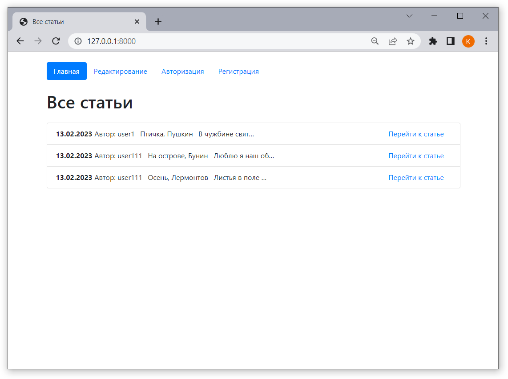
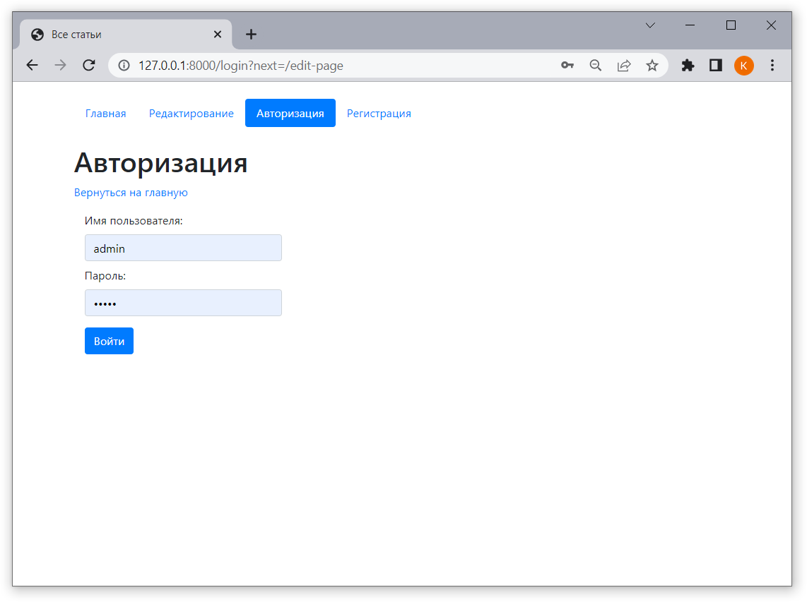
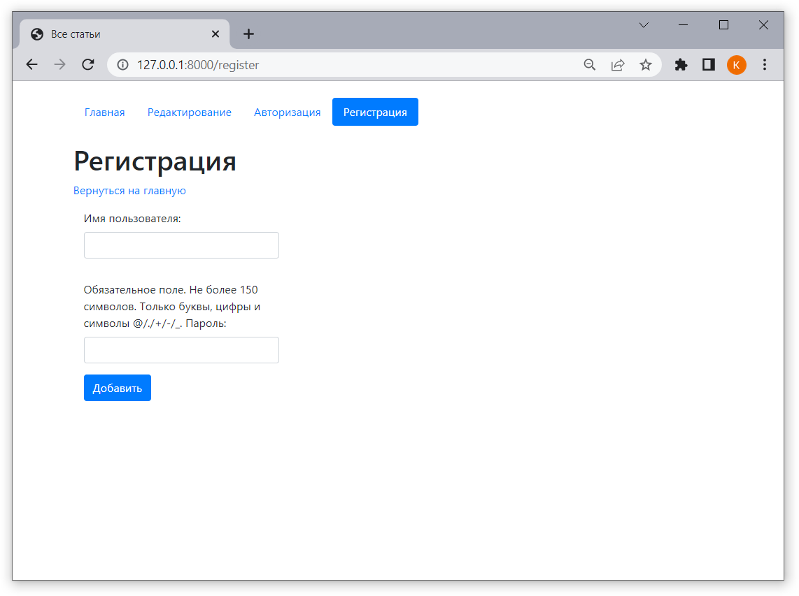
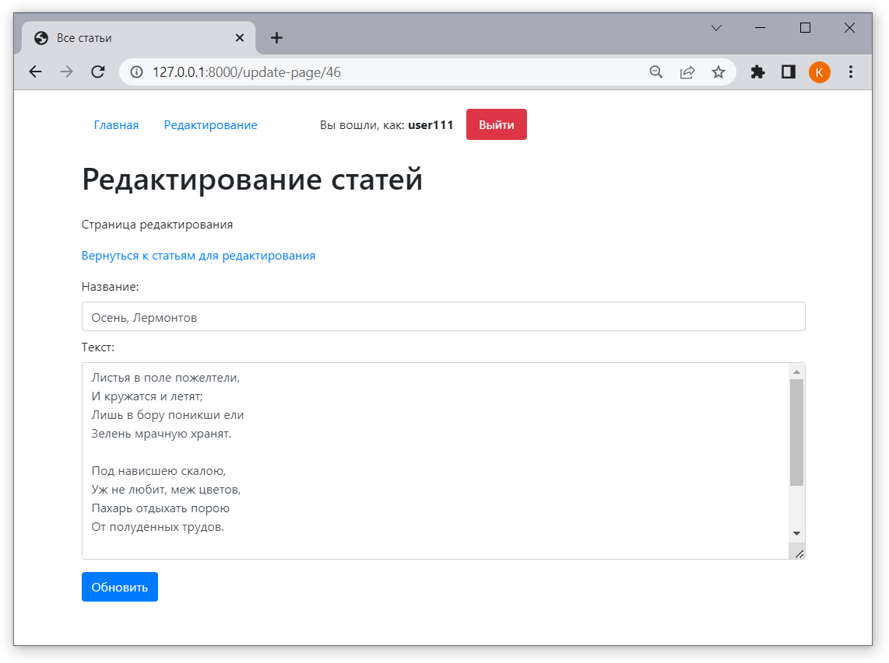
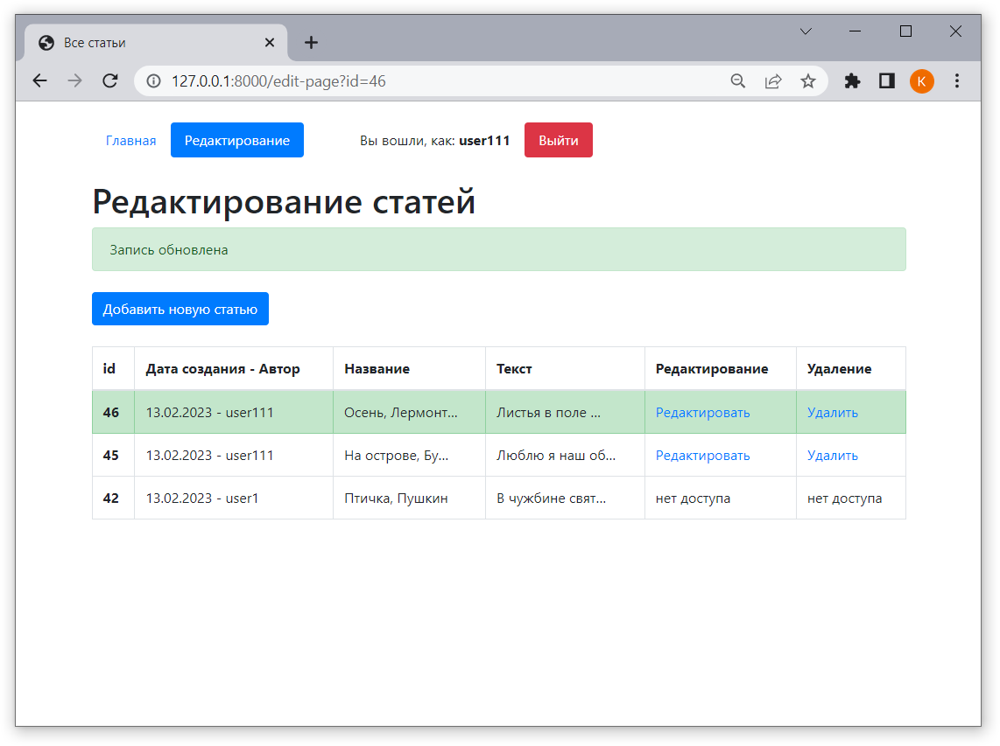
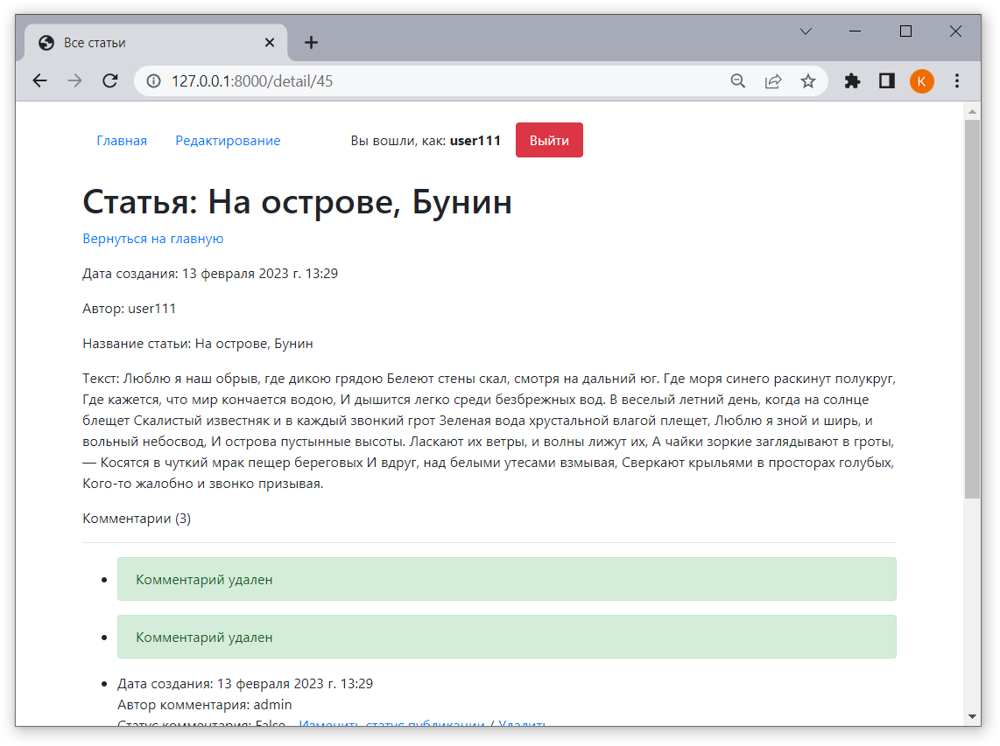
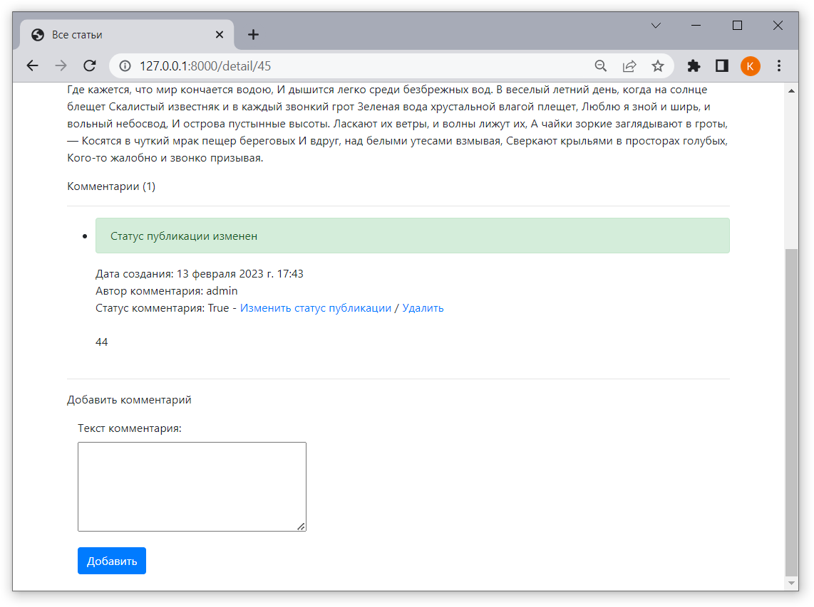
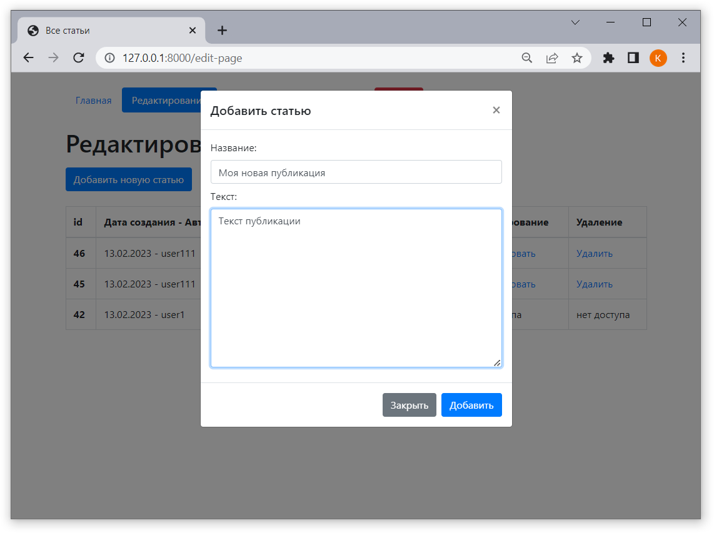
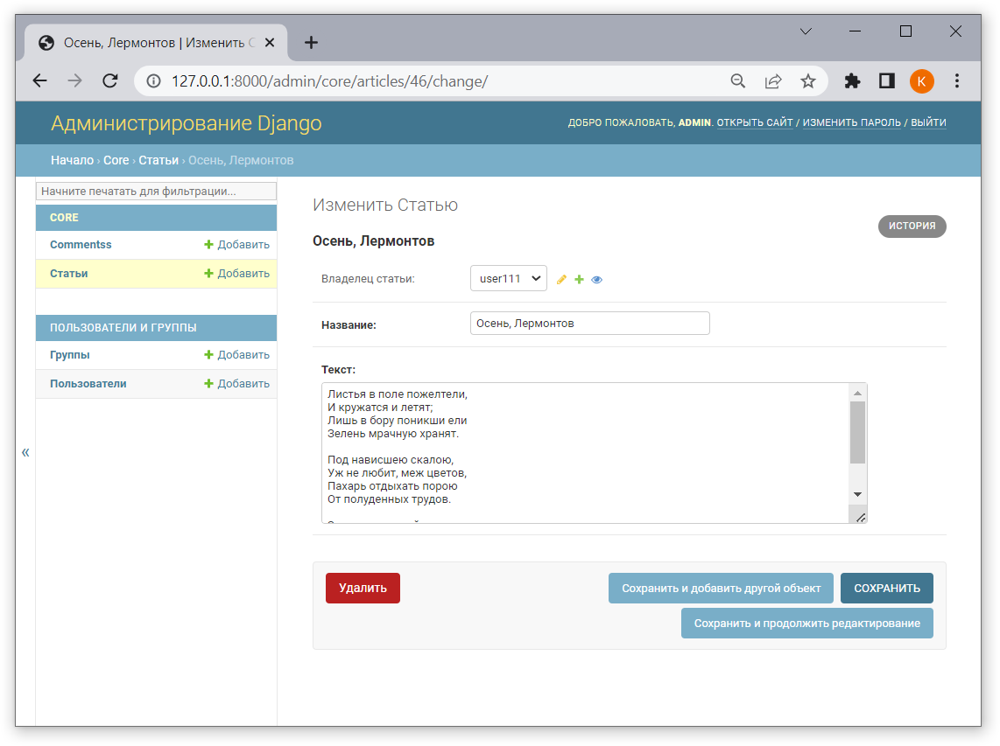

# Приложение для публикации статей 
Приложение, реализующее базовый функционал для публикации и комментирования статей зарегистрированными пользователями.

## Использовано в разработке
- Django
- Python
- HTML
- JavaScript
- Jinja
- SQlite

## Функционал
- регистрация/авторизация пользователей
- статьи:
  - публикация статей
  - редактирование статей
  - удаление статей
  - комментирование статей
- комментарии:
  - добавление комментариев
  - модерация комментариев автором статьи (публикация/удаление)
  - количество комментариев
- страницы сайта:
  - регистрация и авторизация
  - главная с публичным списком статей
  - статья с разделом комментарии
  - список статей для редактирования, удаления
  - форма создания новой статьи
  - форма редактирования статьи
  - админ панель django с БД пользователей, статей, комментариев 
- ограничение доступов:
  - без регистрации - главная страница, страница статьи без комментариев
  - с регистрацией - все страницы, возможность публиковать свои статьи и модерировать комментарии к ним, чтение и добавление комментариев
  - админ - все страницы, редактирование всех статей, публикация и удаление всех комментариев

## Screenshots
Скриншоты основных страниц приложения.

Главная страница

  Страница авторизации 

  Страница регистрации

  Страница редактирования, удаления статей

  Страница редактирования статьи

  Уведомление об успешном обновлении статьи

  Уведомление об удалении комментариев

  Уведомление об изменении статуса комментария

  Форма добавления новой статьи

  Админ панель django, редактирование статьи

